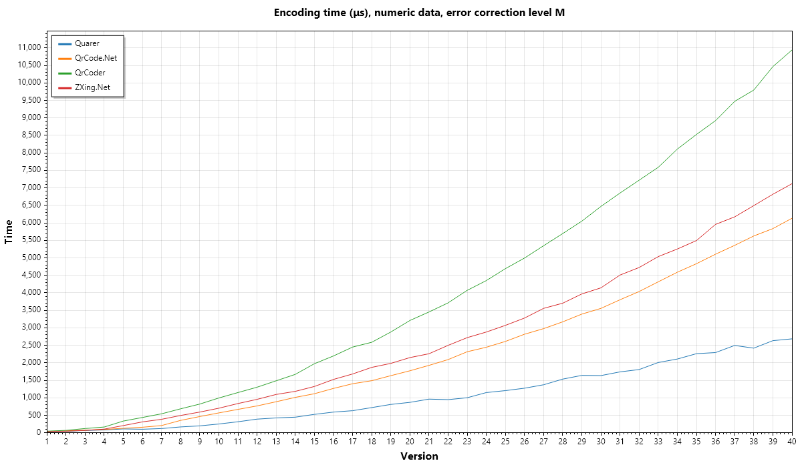

Quarer
=========
A fast and simple-to-use QR code encoding library.

<!-- TODO: Add badges here -->

By vectorizing many parts of the QR Code creation process, Quarer is the fatest QR code library around, without compromising on features or memory usage.



See the full [benchmarks](./benchmarks).


## Installation
```bash
dotnet add package Quarer
```

## Usage

Create a QR Code
```csharp
using Quarer;

var qrCode = QrCode.Create("Hello, World!");

Console.WriteLine(qrCode.Version);
Console.WriteLine(qrCode.Width);
Console.WriteLine(qrCode.ErrorCorrectionLevel);
```

<!-- TODO: Output QR code to terminal in snippet -->

See the [playground](./tools/Playground) for other examples of how to generate an image for a QR code.