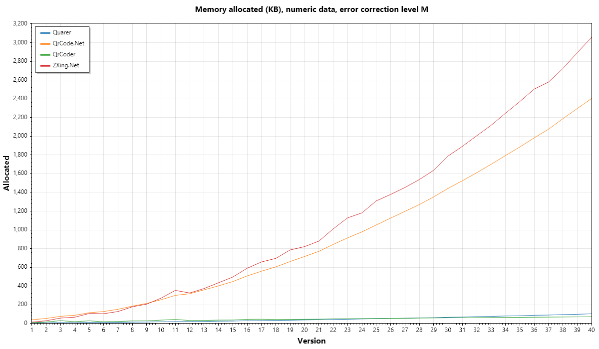
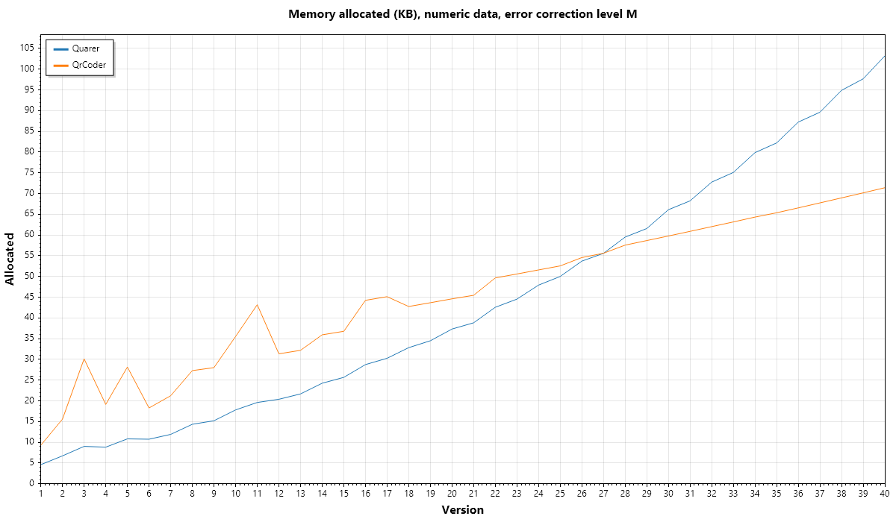

Want to add your library? Open an [issue](https://github.com/JakeYallop/Quarer/issues/new)!






The full list of bencharks (some libraries were excluded from the graphs above for readability):

(ZXing.NET is used as the baseline measurement)

```

BenchmarkDotNet v0.14.0, Windows 11 (10.0.22631.4317/23H2/2023Update/SunValley3)
AMD Ryzen 7 7700X, 1 CPU, 16 logical and 8 physical cores
.NET SDK 9.0.100-rc.2.24474.11
  [Host]   : .NET 9.0.0 (9.0.24.47305), X64 RyuJIT AVX-512F+CD+BW+DQ+VL+VBMI
  ShortRun : .NET 9.0.0 (9.0.24.47305), X64 RyuJIT AVX-512F+CD+BW+DQ+VL+VBMI

Job=ShortRun  OutlierMode=RemoveAll  IterationCount=3  
LaunchCount=1  WarmupCount=3  

```
| Method           | Version        |            Mean |            Error |    Ratio |     Allocated | Alloc Ratio |
| ---------------- | -------------- | --------------: | ---------------: | -------: | ------------: | ----------: |
| **Quarer**       | **Version 1**  |    **30.31 μs** |    **28.543 μs** | **0.99** |   **4.62 KB** |    **0.32** |
| Apose.BarCode    | Version 1      |     2,545.04 μs |     5,327.393 μs |    83.20 |    3221.02 KB |      225.42 |
| QrCode.Net       | Version 1      |        41.28 μs |        13.027 μs |     1.35 |      38.71 KB |        2.71 |
| QrCoder          | Version 1      |        45.83 μs |        22.422 μs |     1.50 |        9.3 KB |        0.65 |
| SkiaSharp.QrCode | Version 1      |       410.49 μs |        68.003 μs |    13.42 |      689.2 KB |       48.23 |
| ZXing.Net        | Version 1      |        30.60 μs |        13.578 μs |     1.00 |      14.29 KB |        1.00 |
|                  |                |                 |                  |          |               |             |
| **Quarer**       | **Version 10** |   **251.74 μs** |   **170.389 μs** | **0.36** |  **17.81 KB** |    **0.07** |
| Apose.BarCode    | Version 10     |     5,730.00 μs |    10,829.340 μs |     8.15 |    9841.89 KB |       36.41 |
| QrCode.Net       | Version 10     |       568.93 μs |       127.443 μs |     0.81 |     253.05 KB |        0.94 |
| QrCoder          | Version 10     |       995.71 μs |       111.053 μs |     1.42 |      35.52 KB |        0.13 |
| SkiaSharp.QrCode | Version 10     |    10,129.94 μs |     2,423.858 μs |    14.41 |   10699.58 KB |       39.58 |
| ZXing.Net        | Version 10     |       703.02 μs |        48.040 μs |     1.00 |     270.32 KB |        1.00 |
|                  |                |                 |                  |          |               |             |
| **Quarer**       | **Version 11** |   **316.24 μs** |    **96.692 μs** | **0.38** |  **19.61 KB** |    **0.06** |
| Apose.BarCode    | Version 11     |     6,634.03 μs |     8,701.322 μs |     7.93 |   11340.41 KB |       32.12 |
| QrCode.Net       | Version 11     |       669.53 μs |       142.860 μs |     0.80 |     299.92 KB |        0.85 |
| QrCoder          | Version 11     |     1,150.63 μs |       322.879 μs |     1.38 |      43.18 KB |        0.12 |
| SkiaSharp.QrCode | Version 11     |    12,711.27 μs |     3,240.666 μs |    15.20 |   13441.81 KB |       38.07 |
| ZXing.Net        | Version 11     |       836.56 μs |       120.314 μs |     1.00 |     353.08 KB |        1.00 |
|                  |                |                 |                  |          |               |             |
| **Quarer**       | **Version 12** |   **390.98 μs** |    **89.162 μs** | **0.41** |  **20.38 KB** |    **0.06** |
| Apose.BarCode    | Version 12     |     6,980.89 μs |     2,223.255 μs |     7.30 |    12818.6 KB |       39.36 |
| QrCode.Net       | Version 12     |       768.78 μs |       179.445 μs |     0.80 |     317.57 KB |        0.98 |
| QrCoder          | Version 12     |     1,303.41 μs |       235.036 μs |     1.36 |      31.34 KB |        0.10 |
| SkiaSharp.QrCode | Version 12     |    11,232.80 μs |     5,705.955 μs |    11.75 |   13464.78 KB |       41.34 |
| ZXing.Net        | Version 12     |       956.36 μs |       177.189 μs |     1.00 |     325.68 KB |        1.00 |
|                  |                |                 |                  |          |               |             |
| **Quarer**       | **Version 13** |   **425.63 μs** |    **67.688 μs** | **0.39** |  **21.67 KB** |    **0.06** |
| Apose.BarCode    | Version 13     |     8,184.31 μs |    11,008.895 μs |     7.46 |   14811.92 KB |       39.72 |
| QrCode.Net       | Version 13     |       888.21 μs |        23.790 μs |     0.81 |     359.05 KB |        0.96 |
| QrCoder          | Version 13     |     1,487.05 μs |       165.579 μs |     1.36 |      32.18 KB |        0.09 |
| SkiaSharp.QrCode | Version 13     |    13,990.83 μs |       508.978 μs |    12.76 |    15505.1 KB |       41.58 |
| ZXing.Net        | Version 13     |     1,096.55 μs |       210.902 μs |     1.00 |      372.9 KB |        1.00 |
|                  |                |                 |                  |          |               |             |
| **Quarer**       | **Version 14** |   **446.76 μs** |    **12.749 μs** | **0.38** |  **24.25 KB** |    **0.06** |
| Apose.BarCode    | Version 14     |    12,835.59 μs |    35,220.325 μs |    10.84 |   16347.58 KB |       37.64 |
| QrCode.Net       | Version 14     |     1,012.64 μs |       202.000 μs |     0.85 |     401.17 KB |        0.92 |
| QrCoder          | Version 14     |     1,669.85 μs |       374.413 μs |     1.41 |      35.92 KB |        0.08 |
| SkiaSharp.QrCode | Version 14     |    16,732.58 μs |     1,549.183 μs |    14.13 |   17724.63 KB |       40.81 |
| ZXing.Net        | Version 14     |     1,184.47 μs |       166.926 μs |     1.00 |     434.27 KB |        1.00 |
|                  |                |                 |                  |          |               |             |
| **Quarer**       | **Version 15** |   **526.77 μs** |   **115.548 μs** | **0.40** |  **25.66 KB** |    **0.05** |
| Apose.BarCode    | Version 15     |     9,581.82 μs |    31,133.391 μs |     7.24 |    19311.6 KB |       38.97 |
| QrCode.Net       | Version 15     |     1,116.68 μs |       277.167 μs |     0.84 |     447.27 KB |        0.90 |
| QrCoder          | Version 15     |     1,974.71 μs |       307.087 μs |     1.49 |      36.77 KB |        0.07 |
| SkiaSharp.QrCode | Version 15     |    18,824.39 μs |     5,609.396 μs |    14.22 |   20115.54 KB |       40.59 |
| ZXing.Net        | Version 15     |     1,324.17 μs |        45.347 μs |     1.00 |     495.59 KB |        1.00 |
|                  |                |                 |                  |          |               |             |
| **Quarer**       | **Version 16** |   **592.28 μs** |    **36.647 μs** | **0.39** |  **28.74 KB** |    **0.05** |
| Apose.BarCode    | Version 16     |    10,962.06 μs |    19,980.091 μs |     7.18 |   22152.46 KB |       37.58 |
| QrCode.Net       | Version 16     |     1,268.98 μs |       324.825 μs |     0.83 |     507.22 KB |        0.86 |
| QrCoder          | Version 16     |     2,196.79 μs |     1,509.131 μs |     1.44 |      44.24 KB |        0.08 |
| SkiaSharp.QrCode | Version 16     |    23,021.93 μs |       753.198 μs |    15.09 |   23990.78 KB |       40.70 |
| ZXing.Net        | Version 16     |     1,526.15 μs |       369.188 μs |     1.00 |     589.42 KB |        1.00 |
|                  |                |                 |                  |          |               |             |
| **Quarer**       | **Version 17** |   **632.33 μs** |   **156.492 μs** | **0.38** |  **30.26 KB** |    **0.05** |
| Apose.BarCode    | Version 17     |    11,550.10 μs |     6,318.260 μs |     6.87 |   25387.15 KB |       38.65 |
| QrCode.Net       | Version 17     |     1,402.25 μs |       619.148 μs |     0.83 |     558.07 KB |        0.85 |
| QrCoder          | Version 17     |     2,450.18 μs |       904.155 μs |     1.46 |      45.12 KB |        0.07 |
| SkiaSharp.QrCode | Version 17     |    25,901.03 μs |     1,355.792 μs |    15.41 |   26904.24 KB |       40.96 |
| ZXing.Net        | Version 17     |     1,681.21 μs |       812.796 μs |     1.00 |     656.79 KB |        1.00 |
|                  |                |                 |                  |          |               |             |
| **Quarer**       | **Version 18** |   **720.69 μs** |   **275.977 μs** | **0.39** |  **32.83 KB** |    **0.05** |
| Apose.BarCode    | Version 18     |    12,307.15 μs |    15,560.553 μs |     6.58 |    28604.5 KB |       41.15 |
| QrCode.Net       | Version 18     |     1,489.27 μs |        36.229 μs |     0.80 |     604.37 KB |        0.87 |
| QrCoder          | Version 18     |     2,586.98 μs |       186.139 μs |     1.38 |      42.75 KB |        0.06 |
| SkiaSharp.QrCode | Version 18     |    25,729.20 μs |     2,605.656 μs |    13.76 |   29032.91 KB |       41.76 |
| ZXing.Net        | Version 18     |     1,869.93 μs |       253.582 μs |     1.00 |     695.19 KB |        1.00 |
|                  |                |                 |                  |          |               |             |
| **Quarer**       | **Version 19** |   **811.36 μs** |    **39.641 μs** | **0.41** |  **34.49 KB** |    **0.04** |
| Apose.BarCode    | Version 19     |    14,416.04 μs |    18,528.997 μs |     7.27 |   32704.55 KB |       41.66 |
| QrCode.Net       | Version 19     |     1,632.91 μs |       185.532 μs |     0.82 |     661.21 KB |        0.84 |
| QrCoder          | Version 19     |     2,880.93 μs |        31.716 μs |     1.45 |      43.66 KB |        0.06 |
| SkiaSharp.QrCode | Version 19     |    26,967.14 μs |     3,307.775 μs |    13.59 |   32369.93 KB |       41.23 |
| ZXing.Net        | Version 19     |     1,984.32 μs |        97.292 μs |     1.00 |     785.13 KB |        1.00 |
|                  |                |                 |                  |          |               |             |
| **Quarer**       | **Version 2**  |    **44.92 μs** |    **15.652 μs** | **0.96** |   **6.73 KB** |    **0.23** |
| Apose.BarCode    | Version 2      |     2,401.17 μs |     5,708.892 μs |    51.35 |    3570.57 KB |      123.09 |
| QrCode.Net       | Version 2      |        55.16 μs |         5.931 μs |     1.18 |       53.7 KB |        1.85 |
| QrCoder          | Version 2      |        69.65 μs |        33.071 μs |     1.49 |      15.59 KB |        0.54 |
| SkiaSharp.QrCode | Version 2      |       982.22 μs |       360.316 μs |    21.01 |    1248.61 KB |       43.04 |
| ZXing.Net        | Version 2      |        46.76 μs |         2.369 μs |     1.00 |      29.01 KB |        1.00 |
|                  |                |                 |                  |          |               |             |
| **Quarer**       | **Version 20** |   **870.19 μs** |   **177.998 μs** | **0.40** |  **37.31 KB** |    **0.05** |
| Apose.BarCode    | Version 20     |    13,891.92 μs |    19,350.342 μs |     6.46 |   36183.13 KB |       44.09 |
| QrCode.Net       | Version 20     |     1,772.86 μs |       191.590 μs |     0.82 |     715.11 KB |        0.87 |
| QrCoder          | Version 20     |     3,210.60 μs |       130.878 μs |     1.49 |       44.6 KB |        0.05 |
| SkiaSharp.QrCode | Version 20     |    31,680.30 μs |     2,246.487 μs |    14.74 |   35314.84 KB |       43.03 |
| ZXing.Net        | Version 20     |     2,149.88 μs |       259.375 μs |     1.00 |     820.65 KB |        1.00 |
|                  |                |                 |                  |          |               |             |
| **Quarer**       | **Version 21** |   **962.99 μs** |   **111.864 μs** | **0.43** |  **38.82 KB** |    **0.04** |
| Apose.BarCode    | Version 21     |    13,974.37 μs |    27,551.178 μs |     6.18 |   39377.41 KB |       44.78 |
| QrCode.Net       | Version 21     |     1,927.39 μs |       163.327 μs |     0.85 |     770.37 KB |        0.88 |
| QrCoder          | Version 21     |     3,453.30 μs |       185.011 μs |     1.53 |      45.45 KB |        0.05 |
| SkiaSharp.QrCode | Version 21     |    34,240.59 μs |     1,320.744 μs |    15.15 |   38003.85 KB |       43.22 |
| ZXing.Net        | Version 21     |     2,259.84 μs |        47.449 μs |     1.00 |     879.31 KB |        1.00 |
|                  |                |                 |                  |          |               |             |
| **Quarer**       | **Version 22** |   **948.22 μs** |    **68.369 μs** | **0.38** |  **42.56 KB** |    **0.04** |
| Apose.BarCode    | Version 22     |    15,687.00 μs |    10,068.115 μs |     6.28 |   44450.37 KB |       44.00 |
| QrCode.Net       | Version 22     |     2,092.77 μs |       104.285 μs |     0.84 |     843.94 KB |        0.84 |
| QrCoder          | Version 22     |     3,714.01 μs |        93.228 μs |     1.49 |      49.64 KB |        0.05 |
| SkiaSharp.QrCode | Version 22     |    38,999.68 μs |     1,042.378 μs |    15.60 |   43092.82 KB |       42.66 |
| ZXing.Net        | Version 22     |     2,499.28 μs |       218.470 μs |     1.00 |    1010.21 KB |        1.00 |
|                  |                |                 |                  |          |               |             |
| **Quarer**       | **Version 23** | **1,002.52 μs** |    **16.428 μs** | **0.37** |  **44.53 KB** |    **0.04** |
| Apose.BarCode    | Version 23     |    18,250.01 μs |    21,797.883 μs |     6.71 |   52738.21 KB |       46.77 |
| QrCode.Net       | Version 23     |     2,316.96 μs |       567.027 μs |     0.85 |     914.12 KB |        0.81 |
| QrCoder          | Version 23     |     4,072.17 μs |       168.929 μs |     1.50 |      50.59 KB |        0.04 |
| SkiaSharp.QrCode | Version 23     |    45,420.93 μs |    32,390.110 μs |    16.70 |   47519.07 KB |       42.14 |
| ZXing.Net        | Version 23     |     2,720.32 μs |       287.483 μs |     1.00 |    1127.66 KB |        1.00 |
|                  |                |                 |                  |          |               |             |
| **Quarer**       | **Version 24** | **1,150.38 μs** |   **115.214 μs** | **0.40** |  **47.91 KB** |    **0.04** |
| Apose.BarCode    | Version 24     |    20,807.77 μs |    18,829.593 μs |     7.22 |   57196.33 KB |       48.44 |
| QrCode.Net       | Version 24     |     2,445.58 μs |       145.367 μs |     0.85 |     977.87 KB |        0.83 |
| QrCoder          | Version 24     |     4,350.88 μs |       207.155 μs |     1.51 |      51.57 KB |        0.04 |
| SkiaSharp.QrCode | Version 24     |    43,173.45 μs |     2,868.195 μs |    14.99 |   51369.15 KB |       43.50 |
| ZXing.Net        | Version 24     |     2,880.49 μs |        17.972 μs |     1.00 |    1180.88 KB |        1.00 |
|                  |                |                 |                  |          |               |             |
| **Quarer**       | **Version 25** | **1,205.99 μs** |    **50.161 μs** | **0.39** |  **49.99 KB** |    **0.04** |
| Apose.BarCode    | Version 25     |    21,547.71 μs |    17,534.427 μs |     7.02 |   64739.47 KB |       49.45 |
| QrCode.Net       | Version 25     |     2,611.82 μs |       105.210 μs |     0.85 |    1051.93 KB |        0.80 |
| QrCoder          | Version 25     |     4,692.23 μs |       219.253 μs |     1.53 |      52.54 KB |        0.04 |
| SkiaSharp.QrCode | Version 25     |    46,168.40 μs |     3,812.492 μs |    15.03 |   56324.91 KB |       43.02 |
| ZXing.Net        | Version 25     |     3,071.29 μs |       106.047 μs |     1.00 |    1309.23 KB |        1.00 |
|                  |                |                 |                  |          |               |             |
| **Quarer**       | **Version 26** | **1,275.32 μs** |   **145.619 μs** | **0.39** |  **53.69 KB** |    **0.04** |
| Apose.BarCode    | Version 26     |    23,188.34 μs |     2,589.764 μs |     7.07 |   70479.76 KB |       51.14 |
| QrCode.Net       | Version 26     |     2,817.43 μs |       276.226 μs |     0.86 |    1125.13 KB |        0.82 |
| QrCoder          | Version 26     |     4,995.25 μs |       143.798 μs |     1.52 |      54.55 KB |        0.04 |
| SkiaSharp.QrCode | Version 26     |    51,155.67 μs |    15,526.569 μs |    15.60 |      60738 KB |       44.07 |
| ZXing.Net        | Version 26     |     3,280.07 μs |       481.708 μs |     1.00 |    1378.12 KB |        1.00 |
|                  |                |                 |                  |          |               |             |
| **Quarer**       | **Version 27** | **1,373.19 μs** |    **40.866 μs** | **0.39** |  **55.57 KB** |    **0.04** |
| Apose.BarCode    | Version 27     |    23,485.42 μs |    12,586.665 μs |     6.60 |   76940.22 KB |       52.96 |
| QrCode.Net       | Version 27     |     2,977.89 μs |        44.293 μs |     0.84 |    1197.31 KB |        0.82 |
| QrCoder          | Version 27     |     5,347.69 μs |       100.870 μs |     1.50 |      55.59 KB |        0.04 |
| SkiaSharp.QrCode | Version 27     |    56,247.45 μs |    30,158.064 μs |    15.81 |   65517.64 KB |       45.10 |
| ZXing.Net        | Version 27     |     3,556.95 μs |       279.345 μs |     1.00 |    1452.75 KB |        1.00 |
|                  |                |                 |                  |          |               |             |
| **Quarer**       | **Version 28** | **1,535.02 μs** |    **22.239 μs** | **0.41** |  **59.48 KB** |    **0.04** |
| Apose.BarCode    | Version 28     |    25,184.47 μs |    28,207.745 μs |     6.80 |   83876.49 KB |       54.58 |
| QrCode.Net       | Version 28     |     3,171.81 μs |       177.216 μs |     0.86 |    1269.83 KB |        0.83 |
| QrCoder          | Version 28     |     5,694.94 μs |        88.143 μs |     1.54 |      57.55 KB |        0.04 |
| SkiaSharp.QrCode | Version 28     |    60,897.01 μs |     2,787.505 μs |    16.44 |    69692.9 KB |       45.35 |
| ZXing.Net        | Version 28     |     3,704.35 μs |        22.168 μs |     1.00 |     1536.8 KB |        1.00 |
|                  |                |                 |                  |          |               |             |
| **Quarer**       | **Version 29** | **1,641.09 μs** |    **47.507 μs** | **0.41** |  **61.55 KB** |    **0.04** |
| Apose.BarCode    | Version 29     |    27,506.08 μs |     5,346.522 μs |     6.93 |   91778.15 KB |       56.08 |
| QrCode.Net       | Version 29     |     3,392.80 μs |        89.709 μs |     0.85 |    1351.56 KB |        0.83 |
| QrCoder          | Version 29     |     6,050.03 μs |        98.449 μs |     1.52 |      58.65 KB |        0.04 |
| SkiaSharp.QrCode | Version 29     |    63,263.12 μs |     5,612.832 μs |    15.94 |   74890.34 KB |       45.76 |
| ZXing.Net        | Version 29     |     3,969.20 μs |       246.900 μs |     1.00 |    1636.56 KB |        1.00 |
|                  |                |                 |                  |          |               |             |
| **Quarer**       | **Version 3**  |    **65.47 μs** |     **5.067 μs** | **0.95** |   **9.02 KB** |    **0.16** |
| Apose.BarCode    | Version 3      |     2,683.00 μs |    13,324.746 μs |    38.80 |    3196.89 KB |       55.62 |
| QrCode.Net       | Version 3      |        75.19 μs |         3.567 μs |     1.09 |      76.13 KB |        1.32 |
| QrCoder          | Version 3      |       122.51 μs |       216.545 μs |     1.77 |      30.13 KB |        0.52 |
| SkiaSharp.QrCode | Version 3      |     1,917.47 μs |       277.749 μs |    27.73 |    2261.95 KB |       39.35 |
| ZXing.Net        | Version 3      |        69.16 μs |        21.524 μs |     1.00 |      57.48 KB |        1.00 |
|                  |                |                 |                  |          |               |             |
| **Quarer**       | **Version 30** | **1,635.25 μs** |    **36.330 μs** | **0.39** |  **66.09 KB** |    **0.04** |
| Apose.BarCode    | Version 30     |    33,031.83 μs |     3,046.541 μs |     7.97 |  103640.81 KB |       57.95 |
| QrCode.Net       | Version 30     |     3,556.08 μs |        55.729 μs |     0.86 |     1442.4 KB |        0.81 |
| QrCoder          | Version 30     |     6,469.80 μs |       269.382 μs |     1.56 |      59.75 KB |        0.03 |
| SkiaSharp.QrCode | Version 30     |    65,338.56 μs |       941.637 μs |    15.77 |   81587.23 KB |       45.62 |
| ZXing.Net        | Version 30     |     4,143.10 μs |       158.510 μs |     1.00 |    1788.43 KB |        1.00 |
|                  |                |                 |                  |          |               |             |
| **Quarer**       | **Version 31** | **1,741.49 μs** |    **58.356 μs** | **0.39** |  **68.22 KB** |    **0.04** |
| Apose.BarCode    | Version 31     |    32,912.32 μs |    15,135.999 μs |     7.30 |  113331.41 KB |       59.91 |
| QrCode.Net       | Version 31     |     3,803.05 μs |       137.816 μs |     0.84 |    1524.51 KB |        0.81 |
| QrCoder          | Version 31     |     6,853.32 μs |       102.916 μs |     1.52 |      60.87 KB |        0.03 |
| SkiaSharp.QrCode | Version 31     |   144,184.00 μs | 1,171,168.266 μs |    31.98 |   87571.02 KB |       46.29 |
| ZXing.Net        | Version 31     |     4,508.88 μs |       393.998 μs |     1.00 |    1891.81 KB |        1.00 |
|                  |                |                 |                  |          |               |             |
| **Quarer**       | **Version 32** | **1,808.30 μs** |   **103.307 μs** | **0.38** |  **72.74 KB** |    **0.04** |
| Apose.BarCode    | Version 32     |    38,353.84 μs |    28,522.559 μs |     8.12 |  124146.99 KB |       61.92 |
| QrCode.Net       | Version 32     |     4,038.56 μs |       116.811 μs |     0.85 |    1609.87 KB |        0.80 |
| QrCoder          | Version 32     |     7,220.32 μs |       760.972 μs |     1.53 |      62.01 KB |        0.03 |
| SkiaSharp.QrCode | Version 32     |   106,885.00 μs |   720,312.486 μs |    22.62 |    93834.3 KB |       46.80 |
| ZXing.Net        | Version 32     |     4,724.82 μs |       235.587 μs |     1.00 |    2004.83 KB |        1.00 |
|                  |                |                 |                  |          |               |             |
| **Quarer**       | **Version 33** | **2,009.73 μs** |   **615.684 μs** | **0.40** |  **75.07 KB** |    **0.04** |
| Apose.BarCode    | Version 33     |    36,755.89 μs |    49,283.956 μs |     7.30 |  136217.32 KB |       64.36 |
| QrCode.Net       | Version 33     |     4,315.25 μs |       270.504 μs |     0.86 |    1700.01 KB |        0.80 |
| QrCoder          | Version 33     |     7,589.11 μs |       161.238 μs |     1.51 |      63.14 KB |        0.03 |
| SkiaSharp.QrCode | Version 33     |    85,273.12 μs |    20,017.012 μs |    16.93 |  100512.75 KB |       47.49 |
| ZXing.Net        | Version 33     |     5,036.44 μs |       158.855 μs |     1.00 |    2116.58 KB |        1.00 |
|                  |                |                 |                  |          |               |             |
| **Quarer**       | **Version 34** | **2,108.89 μs** |   **125.354 μs** | **0.40** |  **79.85 KB** |    **0.04** |
| Apose.BarCode    | Version 34     |    46,566.82 μs |     3,047.345 μs |     8.86 |  153801.22 KB |       68.50 |
| QrCode.Net       | Version 34     |     4,589.79 μs |       204.557 μs |     0.87 |     1793.3 KB |        0.80 |
| QrCoder          | Version 34     |     8,109.56 μs |       266.703 μs |     1.54 |      64.31 KB |        0.03 |
| SkiaSharp.QrCode | Version 34     |    87,207.85 μs |    10,687.337 μs |    16.60 |   107525.7 KB |       47.89 |
| ZXing.Net        | Version 34     |     5,253.31 μs |       291.413 μs |     1.00 |     2245.2 KB |        1.00 |
|                  |                |                 |                  |          |               |             |
| **Quarer**       | **Version 35** | **2,261.64 μs** |   **244.997 μs** | **0.41** |  **82.19 KB** |    **0.03** |
| Apose.BarCode    | Version 35     |    51,187.29 μs |    56,679.128 μs |     9.32 |  166650.57 KB |       70.31 |
| QrCode.Net       | Version 35     |     4,833.31 μs |       323.569 μs |     0.88 |    1885.04 KB |        0.80 |
| QrCoder          | Version 35     |     8,526.94 μs |        84.974 μs |     1.55 |      65.35 KB |        0.03 |
| SkiaSharp.QrCode | Version 35     |   100,799.37 μs |    39,328.302 μs |    18.35 |  113930.06 KB |       48.07 |
| ZXing.Net        | Version 35     |     5,494.70 μs |       379.533 μs |     1.00 |    2370.23 KB |        1.00 |
|                  |                |                 |                  |          |               |             |
| **Quarer**       | **Version 36** | **2,293.45 μs** |   **227.247 μs** | **0.39** |  **87.22 KB** |    **0.03** |
| Apose.BarCode    | Version 36     |    47,829.73 μs |    23,597.185 μs |     8.03 |  182263.29 KB |       72.82 |
| QrCode.Net       | Version 36     |     5,105.61 μs |       425.776 μs |     0.86 |     1982.1 KB |        0.79 |
| QrCoder          | Version 36     |     8,923.64 μs |       251.906 μs |     1.50 |      66.53 KB |        0.03 |
| SkiaSharp.QrCode | Version 36     |   103,739.83 μs |     4,641.635 μs |    17.42 |  121749.52 KB |       48.64 |
| ZXing.Net        | Version 36     |     5,956.53 μs |     2,204.840 μs |     1.00 |    2502.99 KB |        1.00 |
|                  |                |                 |                  |          |               |             |
| **Quarer**       | **Version 37** | **2,496.67 μs** |   **463.602 μs** | **0.40** |  **89.59 KB** |    **0.03** |
| Apose.BarCode    | Version 37     |    54,533.59 μs |    33,353.757 μs |     8.84 |  194501.47 KB |       75.44 |
| QrCode.Net       | Version 37     |     5,357.26 μs |       134.754 μs |     0.87 |    2075.25 KB |        0.80 |
| QrCoder          | Version 37     |     9,472.64 μs |       773.603 μs |     1.53 |      67.73 KB |        0.03 |
| SkiaSharp.QrCode | Version 37     |   102,320.03 μs |     3,726.835 μs |    16.58 |  128719.18 KB |       49.92 |
| ZXing.Net        | Version 37     |     6,172.13 μs |       383.493 μs |     1.00 |    2578.28 KB |        1.00 |
|                  |                |                 |                  |          |               |             |
| **Quarer**       | **Version 38** | **2,420.00 μs** |    **87.911 μs** | **0.37** |  **94.87 KB** |    **0.03** |
| Apose.BarCode    | Version 38     |    68,351.40 μs |    18,952.023 μs |    10.53 |  212241.75 KB |       77.94 |
| QrCode.Net       | Version 38     |     5,625.63 μs |       606.781 μs |     0.87 |    2187.34 KB |        0.80 |
| QrCoder          | Version 38     |     9,795.85 μs |       104.888 μs |     1.51 |      68.94 KB |        0.03 |
| SkiaSharp.QrCode | Version 38     |   119,255.10 μs |    44,473.619 μs |    18.37 |  137433.25 KB |       50.47 |
| ZXing.Net        | Version 38     |     6,492.97 μs |       384.501 μs |     1.00 |     2723.2 KB |        1.00 |
|                  |                |                 |                  |          |               |             |
| **Quarer**       | **Version 39** | **2,633.85 μs** |    **72.765 μs** | **0.39** |  **97.65 KB** |    **0.03** |
| Apose.BarCode    | Version 39     |    62,799.12 μs |    33,349.991 μs |     9.21 |  231501.49 KB |       80.07 |
| QrCode.Net       | Version 39     |     5,836.24 μs |       107.201 μs |     0.86 |    2295.36 KB |        0.79 |
| QrCoder          | Version 39     |    10,466.30 μs |       196.146 μs |     1.54 |      70.15 KB |        0.02 |
| SkiaSharp.QrCode | Version 39     |   118,811.33 μs |    23,476.705 μs |    17.43 |  146487.46 KB |       50.67 |
| ZXing.Net        | Version 39     |     6,817.62 μs |       321.598 μs |     1.00 |    2891.16 KB |        1.00 |
|                  |                |                 |                  |          |               |             |
| **Quarer**       | **Version 4**  |    **81.19 μs** |     **8.311 μs** | **0.77** |   **8.83 KB** |    **0.13** |
| Apose.BarCode    | Version 4      |     2,629.04 μs |     3,442.679 μs |    24.97 |    3828.04 KB |       56.97 |
| QrCode.Net       | Version 4      |        94.31 μs |        27.323 μs |     0.90 |      87.66 KB |        1.30 |
| QrCoder          | Version 4      |       165.49 μs |       100.716 μs |     1.57 |      19.13 KB |        0.28 |
| SkiaSharp.QrCode | Version 4      |     2,304.29 μs |       182.007 μs |    21.88 |    2727.96 KB |       40.60 |
| ZXing.Net        | Version 4      |       105.45 μs |        88.000 μs |     1.00 |       67.2 KB |        1.00 |
|                  |                |                 |                  |          |               |             |
| **Quarer**       | **Version 40** | **2,685.23 μs** |    **78.992 μs** | **0.38** | **103.18 KB** |    **0.03** |
| Apose.BarCode    | Version 40     |    66,109.89 μs |     3,766.962 μs |     9.29 |  252314.07 KB |       82.56 |
| QrCode.Net       | Version 40     |     6,131.84 μs |       174.711 μs |     0.86 |    2402.83 KB |        0.79 |
| QrCoder          | Version 40     |    10,940.99 μs |       149.701 μs |     1.54 |      71.39 KB |        0.02 |
| SkiaSharp.QrCode | Version 40     |   127,139.73 μs |     8,024.951 μs |    17.86 |  156209.75 KB |       51.11 |
| ZXing.Net        | Version 40     |     7,119.78 μs |       356.416 μs |     1.00 |    3056.21 KB |        1.00 |
|                  |                |                 |                  |          |               |             |
| **Quarer**       | **Version 5**  |   **111.24 μs** |    **23.155 μs** | **0.54** |  **10.83 KB** |    **0.10** |
| Apose.BarCode    | Version 5      |     3,110.92 μs |     3,603.945 μs |    15.06 |    4545.53 KB |       42.66 |
| QrCode.Net       | Version 5      |       129.54 μs |        28.173 μs |     0.63 |     114.44 KB |        1.07 |
| QrCoder          | Version 5      |       336.00 μs |        28.490 μs |     1.63 |      28.16 KB |        0.26 |
| SkiaSharp.QrCode | Version 5      |     3,716.73 μs |        40.425 μs |    17.99 |    4055.03 KB |       38.05 |
| ZXing.Net        | Version 5      |       206.63 μs |        41.654 μs |     1.00 |     106.56 KB |        1.00 |
|                  |                |                 |                  |          |               |             |
| **Quarer**       | **Version 6**  |   **102.00 μs** |   **111.442 μs** | **0.33** |  **10.75 KB** |    **0.10** |
| Apose.BarCode    | Version 6      |     3,507.28 μs |     6,313.773 μs |    11.23 |    5214.35 KB |       50.17 |
| QrCode.Net       | Version 6      |       159.34 μs |       128.471 μs |     0.51 |     127.54 KB |        1.23 |
| QrCoder          | Version 6      |       438.46 μs |        13.525 μs |     1.40 |      18.28 KB |        0.18 |
| SkiaSharp.QrCode | Version 6      |     3,555.36 μs |       577.434 μs |    11.39 |    4348.12 KB |       41.84 |
| ZXing.Net        | Version 6      |       312.25 μs |        85.792 μs |     1.00 |     103.93 KB |        1.00 |
|                  |                |                 |                  |          |               |             |
| **Quarer**       | **Version 7**  |   **121.92 μs** |    **82.444 μs** | **0.32** |  **11.91 KB** |    **0.09** |
| Apose.BarCode    | Version 7      |     3,936.10 μs |    13,865.264 μs |    10.20 |    5953.04 KB |       46.75 |
| QrCode.Net       | Version 7      |       207.12 μs |       303.611 μs |     0.54 |     151.18 KB |        1.19 |
| QrCoder          | Version 7      |       542.91 μs |        44.602 μs |     1.41 |      21.23 KB |        0.17 |
| SkiaSharp.QrCode | Version 7      |     4,729.17 μs |       260.792 μs |    12.26 |    5268.71 KB |       41.38 |
| ZXing.Net        | Version 7      |       385.81 μs |        25.971 μs |     1.00 |     127.33 KB |        1.00 |
|                  |                |                 |                  |          |               |             |
| **Quarer**       | **Version 8**  |   **168.41 μs** |    **52.088 μs** | **0.34** |  **14.35 KB** |    **0.08** |
| Apose.BarCode    | Version 8      |     4,263.09 μs |     6,349.419 μs |     8.60 |    7055.75 KB |       39.70 |
| QrCode.Net       | Version 8      |       355.44 μs |        72.336 μs |     0.72 |     185.01 KB |        1.04 |
| QrCoder          | Version 8      |       686.11 μs |        15.198 μs |     1.38 |      27.29 KB |        0.15 |
| SkiaSharp.QrCode | Version 8      |     5,827.08 μs |       414.655 μs |    11.76 |    7015.38 KB |       39.47 |
| ZXing.Net        | Version 8      |       495.55 μs |        19.683 μs |     1.00 |     177.72 KB |        1.00 |
|                  |                |                 |                  |          |               |             |
| **Quarer**       | **Version 9**  |   **198.87 μs** |    **62.592 μs** | **0.34** |   **15.2 KB** |    **0.07** |
| Apose.BarCode    | Version 9      |     5,175.90 μs |       261.181 μs |     8.73 |    8207.47 KB |       39.80 |
| QrCode.Net       | Version 9      |       464.57 μs |        11.597 μs |     0.78 |     214.38 KB |        1.04 |
| QrCoder          | Version 9      |       821.29 μs |        23.439 μs |     1.39 |      28.01 KB |        0.14 |
| SkiaSharp.QrCode | Version 9      |     7,664.08 μs |       578.485 μs |    12.92 |    8406.76 KB |       40.76 |
| ZXing.Net        | Version 9      |       592.97 μs |        39.633 μs |     1.00 |     206.23 KB |        1.00 |
